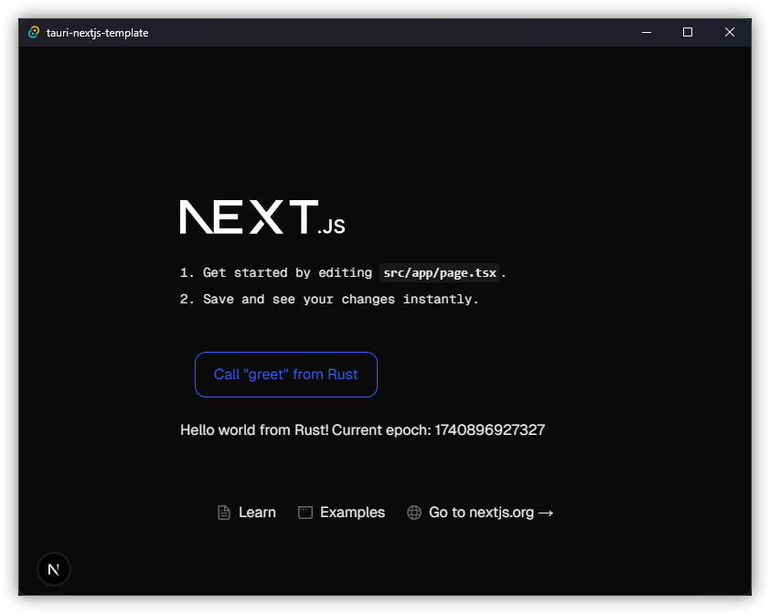

# Tauri 2.0 + Next.js 15 App Router 模板



这是一个基于 [Tauri](https://v2.tauri.app/) 和 [Next.js](https://nextjs.org/) 的项目模板，
通过结合 [`create-next-app`](https://github.com/vercel/next.js/tree/canary/packages/create-next-app)
和 [`create tauri-app`](https://v2.tauri.app/start/create-project/) 启动。

本模板使用 [`pnpm`](https://pnpm.io/) 作为 Node.js 的依赖管理器，
并采用 Next.js 的 [App Router](https://nextjs.org/docs/app) 模式。

## 模板特性

- 前端使用 [Next.js 15](https://nextjs.org/) React 框架的 TypeScript
- [TailwindCSS 4](https://tailwindcss.com/) 作为原子化 CSS 工具框架
  - 本模板示例页面已全部使用 TailwindCSS
  - 默认未包含，但建议使用 [React Aria 组件](https://react-spectrum.adobe.com/react-aria/index.html)
    和/或 [HeadlessUI 组件](https://headlessui.com/)，它们是完全无样式且无障碍的 UI 组件，能很好地与 TailwindCSS 集成
- 已配置并启用格式化和代码检查
  - [Biome](https://biomejs.dev/) 用于 TypeScript 代码的快速格式化、检查和导入排序，[ESLint](https://eslint.org/) 用于补充 Biome 未覆盖的 Next.js 规则
  - [clippy](https://github.com/rust-lang/rust-clippy) 和 [rustfmt](https://github.com/rust-lang/rustfmt) 用于 Rust 代码
- GitHub Actions 自动检查 TypeScript 和 Rust 的代码格式与规范

## 快速开始

### 启动开发服务器并使用 Tauri 窗口

首次克隆后，请在 `src-tauri/tauri.conf.json` 中修改应用标识符：

```jsonc
{
  // ...
  // 默认的 "com.tauri.dev" 会导致无法以 release 模式构建
  "identifier": "com.my-application-name.app",
  // ...
}
```

开发并在 Tauri 窗口中运行前端：

```shell
pnpm tauri dev
```

这会在 Tauri 的 webview 窗口中加载 Next.js 前端，同时在 `localhost:3000` 启动开发服务器。
在 Chromium 内核的 WebView（如 Windows）中，按 <kbd>Ctrl</kbd>+<kbd>Shift</kbd>+<kbd>I</kbd> 可打开开发者工具。

### 构建发布版本

初始化 android

```sh
pnpm tauri android init
```

初始化ios

```sh
pnpm tauri ios init
```


通过 SSG 导出 Next.js 前端并构建 Tauri 应用发布包：

```shell
pnpm tauri build
```

打包 android apk

```sh
pnpm tauri android build --apk
```

打包 ios ipa

```sh
pnpm tauri ios build
```

打包macOS桌面应用

```sh
pnpm tauri build --target x86_64-apple-darwin
```

打包Windows桌面应用
```sh
pnpm tauri build --runner cargo-xwin --target x86_64-pc-windows-msvc
```


### 目录结构

Next.js 前端源码位于 `src/`，Tauri Rust 应用源码位于 `src-tauri/`。
如需了解更多，请分别查阅 Next.js 和 Tauri 官方文档。

## 注意事项

### 静态站点生成 / 预渲染

Next.js 是一个优秀的 React 前端框架，支持服务端渲染（SSR）和静态站点生成（SSG/预渲染）。
作为 Tauri 前端，只能使用 SSG，因为 SSR 需要一个持续运行的 Node.js 服务器。

请查阅 Next.js 文档的 [静态导出](https://nextjs.org/docs/app/building-your-application/deploying/static-exports)
，了解支持/不支持的特性及注意事项。

### `next/image`

[`next/image` 组件](https://nextjs.org/docs/basic-features/image-optimization)
是对普通 `` 元素的增强，支持服务端优化图片质量。
但该特性仅在直接部署到 Vercel 时可用，静态导出时需禁用。
因此，在 `next.config.js` 中已为 `next/image` 组件设置 [`unoptimized` 属性](https://nextjs.org/docs/api-reference/next/image#unoptimized) 为 true。
这样图片将按原样提供，不会改变质量、尺寸或格式。

### ReferenceError: window/navigator is not defined

如果你在 JavaScript 中使用 Tauri 的 `invoke` 或任何与操作系统相关的函数，
在全局或非浏览器环境下导入时，可能会遇到此错误。
这是因为 Next.js 的开发服务器本质上运行在 Node.js 上，
而 Node.js 没有 `window` 或 `navigator`。

解决方法是：确保 Tauri 相关函数只在客户端 React 组件中按需导入，
或通过 [懒加载](https://nextjs.org/docs/app/building-your-application/optimizing/lazy-loading) 实现。

## 了解更多

想了解 Next.js，请参考以下资源：

- [Next.js 官方文档](https://nextjs.org/docs) - 了解 Next.js 的特性和 API。
- [Next.js 互动教程](https://nextjs.org/learn) - 交互式 Next.js 教程。

想了解 Tauri，请参考：

- [Tauri 官方文档 - 指南](https://v2.tauri.app/start/) - 了解 Tauri 工具包。
